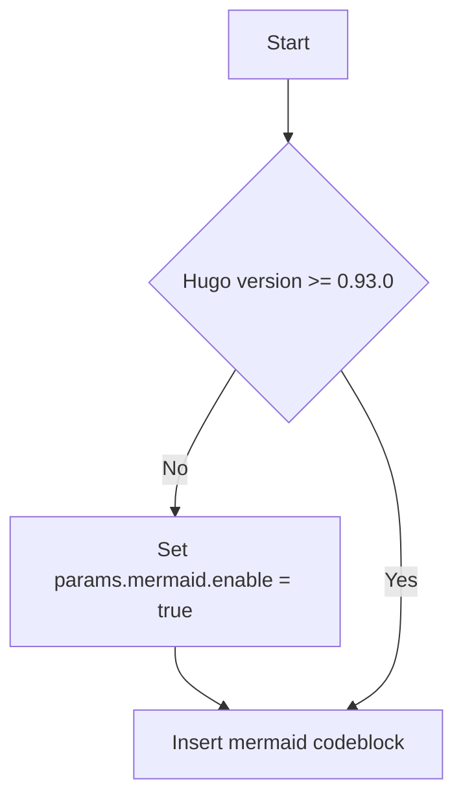

```plantuml
participant participant as Foo
actor       actor       as Foo1
boundary    boundary    as Foo2
control     control     as Foo3
entity      entity      as Foo4
database    database    as Foo5
collections collections as Foo6
queue       queue       as Foo7
Foo -> Foo1 : To actor
Foo -> Foo2 : To boundary
Foo -> Foo3 : To control
Foo -> Foo4 : To entity
Foo -> Foo5 : To database
Foo -> Foo6 : To collections
Foo -> Foo7: To queue
```


# 二、源码安装脚本


```bash
#!/bin/bash
start_time=$(date +"%Y-%m-%dT%H:%M:%S")
gcc_version='11.4.0'
gcc_targz="gcc-${gcc_version}.tar.gz"
gcc_targz_dir="gcc-${gcc_version}"
install_dir="/usr/local/gcc-${gcc_version}"
work_dir="/home/work/"
cd $work_dir || mkdir -p $work_dir

# 确定软件包下载地址：
gcc_address="https://ftp.gnu.org/gnu/gcc/gcc-${gcc_version}/gcc-${gcc_version}.tar.gz"
gmp_tarbz2='http://gcc.gnu.org/pub/gcc/infrastructure/gmp-6.1.0.tar.bz2'
mpfr_tarbz2='http://gcc.gnu.org/pub/gcc/infrastructure/mpfr-3.1.6.tar.bz2'
mpc_targz='http://gcc.gnu.org/pub/gcc/infrastructure/mpc-1.0.3.tar.gz'
isl_tarbz2='http://gcc.gnu.org/pub/gcc/infrastructure/isl-0.18.tar.bz2'

# 获取安装包
function wget_package(){
	test ! -f $gcc_targz && wget $gcc_address || echo "$gcc_targz exists or wget error"
	test ! -f $gcc_targz_dir && tar -xzvf $gcc_targz || echo "$gcc_targz_dir exists"
	cd $gcc_targz_dir
	test ! -f $gmp_tarbz2 && wget $gcc_address || echo "$gmp_tarbz2 exists or wget error"
	test ! -f $mpfr_tarbz2 && wget $gmp_tarbz2 || echo "$mpfr_tarbz2 exists or wget error"
	test ! -f $mpc_targz && wget $mpc_targz || echo "$mpc_targz exists or wget error"
	test ! -f $isl_tarbz2 && wget $isl_tarbz2 || echo "$isl_tarbz2 exists or wget error"
}

function install(){
	cd $work_dir && cd $gcc_targz_dir || exit 1
	rm -rf build
	mkdir build && cd build || exit 1
	(../configure --enable-checking=release --enable-languages=c,c++ --disable-multilib  --enable-bootstrap  --prefix=${install_dir} || exit 11) && (make -j 4 || exit 12) && (make install || exit 13)
	ls /usr/lib64/libstdc++.so.6 && mv /usr/lib64/libstdc++.so.6 /usr/lib64/libstdc++.so.6.${start_time}
	ln -s ${install_dir}/lib64/libstdc++.so.6  /usr/lib64/libstdc++.so.6

	# 替换gcc相关二进制程序
	for i in $(ls ${install_dir}/bin)
	do
		test -f /usr/bin/${i} && (mv /usr/bin/${i} /usr/bin/${i}.${start_time} && ln -s ${install_dir}/bin/${i} /usr/bin/${i} || exit 21)
	done
}

# main
function main(){
	wget_package
	install
}

# do main
main
```


## math

```math
When (a \ne 0), there are two solutions to (ax^2 + bx + c= 0) and they are (x = {-b \pm \sqrt{b^2-4ac} \over 2a}).
```


### si和ti节点创建数据库连接和ping

```go
// init mysql connection with pass ...
// 根据节点的mysql连接信息，创建连接，然后ping
// 正常：{"level":"info","msg":"mysql ping connection successfully","time":"2023-09-19 22:55:28"}
// 异常：mysql create connection failed 和 mysql ping connection failed

func (d *Node) init_mysql_conn() error {
	dbSource := fmt.Sprintf("%s:%s@tcp(%s:%s)/%s?charset=utf8", d.MySQL_User, d.MySQL_Password, d.MySQL_Ip, d.MySQL_Port, d.Database)
	db, err := sqlx.Open("mysql", dbSource)
	if err != nil {
		flashback_log.WithFields(logrus.Fields{
			"ip":       d.MySQL_Ip,
			"port":     d.MySQL_Port,
			"username": d.MySQL_User,
			"password": d.MySQL_Password,
			"database": d.Database,
			"errMsg":   err.Error(),
		}).Error("mysql create connection failed")
		return err
	}

	if err = db.Ping(); err != nil {
		flashback_log.WithFields(logrus.Fields{
			"ip":       d.MySQL_Ip,
			"port":     d.MySQL_Port,
			"username": d.MySQL_User,
			"password": d.MySQL_Password,
			"database": d.Database,
			"errMsg":   err.Error(),
		}).Error("mysql ping connection failed")
		return err
	}
	flashback_log.Info("mysql ping connection successfully")

	db.SetConnMaxIdleTime(time.Minute * 5)
	db.SetMaxOpenConns(1)
	d.db = db
	return nil
}

// si节点：{"level":"info","msg":"mysql ping connection successfully","time":"2023-09-19 22:55:28"}
// ti节点：{"level":"info","msg":"mysql ping connection successfully","time":"2023-09-19 22:58:18"}
```


### si节点执行：dbscale show dataservers

```go
// get_multi_row_data
// router节点执行：dbscale show dataservers
// 然后返回结果


func (d *Node) get_multi_row_data(destSlice interface{}, sqlStr string) error {
	if d.db == nil {
		d.init_mysql_conn()
	}
	err := d.db.Select(destSlice, sqlStr)
	if err != nil {
		flashback_log.WithFields(logrus.Fields{
			"username":  d.MySQL_User,
			"password":  d.MySQL_Password,
			"ip":        d.MySQL_Ip,
			"port":      d.MySQL_Port,
			"database":  d.Database,
			"statement": sqlStr,
			"errMsg":    err.Error(),
		}).Error("query failed")
		return err
	}
	flashback_log.WithFields(logrus.Fields{
		"username":  d.MySQL_User,
		"password":  d.MySQL_Password,
		"ip":        d.MySQL_Ip,
		"port":      d.MySQL_Port,
		"database":  d.Database,
		"statement": sqlStr,
	}).Debug("query successfully")
	return nil
}

// 正常：{"database":"information_schema","ip":"172.17.138.0","level":"debug","msg":"query successfully","password":"123456","port":"3307","statement":"dbscale show dataservers","time":"2023-09-19 23:02:55","username":"admin"}
```


### 生产和灾备每个节点测试数据库ping和ssh连接

```go
// 根据si节点执行的dbscale show dataservers获取生产集群的所有节点
// 筛选规则是：servername不为slave_dbscale_server
// 除了host和port信息从dbscale show dataservers获取，其余信息从全局节点global_source_instance获取
// 生产集群每个节点都

for _, dataserver := range source_data_servers {
		if dataserver.Servername == "slave_dbscale_server" {
			continue
		}
		var ins Node
		ins.MySQL_Ip = dataserver.Host
		ins.MySQL_Port = dataserver.Port
		ins.MySQL_User = global_source_instance.MySQL_User
		ins.MySQL_Password = global_source_instance.MySQL_Password
		ins.Database = global_source_instance.Database

		ins.SysIp = ins.MySQL_Ip
		ins.SysPort = global_source_instance.SysPort
		ins.SysUser = global_source_instance.SysUser
		ins.SysPassword = global_source_instance.SysPassword

		ins.ServerName = dataserver.Servername

		err = ins.init_mysql_conn()
		if err != nil {
			return err
		}

		err = ins.init_sys_con()
		if err != nil {
			return err
		}

		source_nodes = append(source_nodes, ins)
	}

// 正常：
// {"level":"info","msg":"mysql ping connection successfully","time":"2023-09-19 23:14:06"}
// {"level":"info","msg":"init sys con by pass failed ","time":"2023-09-19 23:14:09"}
// {"level":"info","msg":"init sys con by rsa successfully","time":"2023-09-19 23:14:10"}

```

#### dbscale show dataservers;

```sql
-- 生产集群
mysql> dbscale show dataservers\G
*************************** 1. row ***************************
                    servername: database_1
                          host: 172.17.138.1
                          port: 3308
                      username: dbscale_internal
                        status: Slave normal
          master-online-status: Not_A_Master
                 master_backup: 1
                   remote_user: root
                   remote_port: 22
max_needed_conn/max_mysql_conn:
               master_priority: 0
*************************** 2. row ***************************
                    servername: database_2
                          host: 172.17.138.0
                          port: 3308
                      username: dbscale_internal
                        status: Slave normal
          master-online-status: Not_A_Master
                 master_backup: 1
                   remote_user: root
                   remote_port: 22
max_needed_conn/max_mysql_conn:
               master_priority: 0
*************************** 3. row ***************************
                    servername: database_3
                          host: 172.17.138.2
                          port: 3308
                      username: dbscale_internal
                        status: Server normal
          master-online-status: Master_Online
                 master_backup: 1
                   remote_user: root
                   remote_port: 22
max_needed_conn/max_mysql_conn:
               master_priority: 0
*************************** 4. row ***************************
                    servername: slave_dbscale_server
                          host: 172.17.138.181
                          port: 3307
                      username: dbscale_internal
                        status: Slave normal
          master-online-status: Not_A_Master
                 master_backup: 1
                   remote_user:
                   remote_port:
max_needed_conn/max_mysql_conn:
               master_priority: 0
4 rows in set (0.00 sec)

-- 灾备集群

mysql> dbscale show dataservers\G
*************************** 1. row ***************************
                    servername: database_1
                          host: 172.17.138.182
                          port: 3308
                      username: dbscale_internal
                        status: Server normal
          master-online-status: Master_Online
                 master_backup: 1
                   remote_user: root
                   remote_port: 22
max_needed_conn/max_mysql_conn:
               master_priority: 0
*************************** 2. row ***************************
                    servername: database_2
                          host: 172.17.138.180
                          port: 3308
                      username: dbscale_internal
                        status: Slave normal
          master-online-status: Not_A_Master
                 master_backup: 1
                   remote_user: root
                   remote_port: 22
max_needed_conn/max_mysql_conn:
               master_priority: 0
*************************** 3. row ***************************
                    servername: database_3
                          host: 172.17.138.181
                          port: 3308
                      username: dbscale_internal
                        status: Slave normal
          master-online-status: Not_A_Master
                 master_backup: 1
                   remote_user: root
                   remote_port: 22
max_needed_conn/max_mysql_conn:
               master_priority: 0
3 rows in set (0.00 sec)

```


### 生产集群router执行：dbscale show dataservers中slave_dbscale_server必须存在


# next
Text can be **bold**, _italic_, or ~~strikethrough~~. [Links](https://github.com) should be blue with no underlines (unless hovered over).

There should be whitespace between paragraphs. There should be whitespace between paragraphs. There should be whitespace between paragraphs. There should be whitespace between paragraphs.

There should be whitespace between paragraphs. There should be whitespace between paragraphs. There should be whitespace between paragraphs. There should be whitespace between paragraphs.

> There should be no margin above this first sentence.
>
> Blockquotes should be a lighter gray with a border along the left side in the secondary color.
>
> There should be no margin below this final sentence.

## First Header

This is a normal paragraph following a header. Bacon ipsum dolor sit amet t-bone doner shank drumstick, pork belly porchetta chuck sausage brisket ham hock rump pig. Chuck kielbasa leberkas, pork bresaola ham hock filet mignon cow shoulder short ribs biltong.  Bacon ipsum dolor sit amet t-bone doner shank drumstick, pork belly porchetta chuck sausage brisket ham hock rump pig. Chuck kielbasa leberkas, pork bresaola ham hock filet mignon cow shoulder short ribs biltong.  Bacon ipsum dolor sit amet t-bone doner shank drumstick, pork belly porchetta chuck sausage brisket ham hock rump pig. Chuck kielbasa leberkas, pork bresaola ham hock filet mignon cow shoulder short ribs biltong.


Bacon ipsum dolor sit amet t-bone doner shank drumstick, pork belly porchetta chuck sausage brisket ham hock rump pig. Chuck kielbasa leberkas, pork bresaola ham hock filet mignon cow shoulder short ribs biltong.

On big screens, paragraphs and headings should not take up the full container width, but we want tables, code blocks and similar to take the full width.

Lorem markdownum tuta hospes stabat; idem saxum facit quaterque repetito
occumbere, oves novem gestit haerebat frena; qui. Respicit recurvam erat:
pignora hinc reppulit nos **aut**, aptos, ipsa.

Meae optatos *passa est* Epiros utiliter *Talibus niveis*, hoc lata, edidit.
Dixi ad aestum.

## Header 2

> This is a blockquote following a header. Bacon ipsum dolor sit amet t-bone doner shank drumstick, pork belly porchetta chuck sausage brisket ham hock rump pig. Chuck kielbasa leberkas, pork bresaola ham hock filet mignon cow shoulder short ribs biltong.

### Header 3

```
This is a code block following a header.
```

#### Header 4

* This is an unordered list following a header.
* This is an unordered list following a header.
* This is an unordered list following a header.

##### Header 5

1. This is an ordered list following a header.
2. This is an ordered list following a header.
3. This is an ordered list following a header.

###### Header 6

| What      | Follows         |
|-----------|-----------------|
| A table   | A header        |
| A table   | A header        |
| A table   | A header        |

----------------

There's a horizontal rule above and below this.

----------------

Here is an unordered list:

* Salt-n-Pepa
* Bel Biv DeVoe
* Kid 'N Play

And an ordered list:

1. Michael Jackson
2. Michael Bolton
3. Michael Bublé

And an unordered task list:

- [x] Create a sample markdown document
- [x] Add task lists to it
- [ ] Take a vacation

And a "mixed" task list:

- [ ] Steal underpants
- ?
- [ ] Profit!

And a nested list:

* Jackson 5
  * Michael
  * Tito
  * Jackie
  * Marlon
  * Jermaine
* TMNT
  * Leonardo
  * Michelangelo
  * Donatello
  * Raphael

Definition lists can be used with Markdown syntax. Definition terms are bold.

Name
: Godzilla

Born
: 1952

Birthplace
: Japan

Color
: Green


----------------

Tables should have bold headings and alternating shaded rows.

| Artist            | Album           | Year |
|-------------------|-----------------|------|
| Michael Jackson   | Thriller        | 1982 |
| Prince            | Purple Rain     | 1984 |
| Beastie Boys      | License to Ill  | 1986 |

If a table is too wide, it should scroll horizontally.

| Artist            | Album           | Year | Label       | Awards   | Songs     |
|-------------------|-----------------|------|-------------|----------|-----------|
| Michael Jackson   | Thriller        | 1982 | Epic Records | Grammy Award for Album of the Year, American Music Award for Favorite Pop/Rock Album, American Music Award for Favorite Soul/R&B Album, Brit Award for Best Selling Album, Grammy Award for Best Engineered Album, Non-Classical | Wanna Be Startin' Somethin', Baby Be Mine, The Girl Is Mine, Thriller, Beat It, Billie Jean, Human Nature, P.Y.T. (Pretty Young Thing), The Lady in My Life |
| Prince            | Purple Rain     | 1984 | Warner Brothers Records | Grammy Award for Best Score Soundtrack for Visual Media, American Music Award for Favorite Pop/Rock Album, American Music Award for Favorite Soul/R&B Album, Brit Award for Best Soundtrack/Cast Recording, Grammy Award for Best Rock Performance by a Duo or Group with Vocal | Let's Go Crazy, Take Me With U, The Beautiful Ones, Computer Blue, Darling Nikki, When Doves Cry, I Would Die 4 U, Baby I'm a Star, Purple Rain |
| Beastie Boys      | License to Ill  | 1986 | Mercury Records | noawardsbutthistablecelliswide | Rhymin & Stealin, The New Style, She's Crafty, Posse in Effect, Slow Ride, Girls, (You Gotta) Fight for Your Right, No Sleep Till Brooklyn, Paul Revere, Hold It Now, Hit It, Brass Monkey, Slow and Low, Time to Get Ill |

----------------

Code snippets like `var foo = "bar";` can be shown inline.

Also, `this should vertically align` ~~`with this`~~ ~~and this~~.

Code can also be shown in a block element.

```
foo := "bar";
bar := "foo";
```

Code can also use syntax highlighting.

```go
func main() {
        input := `var foo = "bar";`

        lexer := lexers.Get("javascript")
        iterator, _ := lexer.Tokenise(nil, input)
        style := styles.Get("github")
        formatter := html.New(html.WithLineNumbers())

        var buff bytes.Buffer
        formatter.Format(&buff, style, iterator)

        fmt.Println(buff.String())
}
```

```
Long, single-line code blocks should not wrap. They should horizontally scroll if they are too long. This line should be long enough to demonstrate this.
```

Inline code inside table cells should still be distinguishable.

| Language    | Code               |
|-------------|--------------------|
| Javascript  | `var foo = "bar";` |
| Ruby        | `foo = "bar"{`      |

----------------

Small images should be shown at their actual size.


Large images should always scale down and fit in the content container.


## Components

### Alerts

This is an alert.
This is an alert with a title.
This is a successful alert.
This is a warning!
This is a warning with a title!


## Sizing

Add some sections here to see how the ToC looks like. Bacon ipsum dolor sit amet t-bone doner shank drumstick, pork belly porchetta chuck sausage brisket ham hock rump pig. Chuck kielbasa leberkas, pork bresaola ham hock filet mignon cow shoulder short ribs biltong.

### Parameters available

Bacon ipsum dolor sit amet t-bone doner shank drumstick, pork belly porchetta chuck sausage brisket ham hock rump pig. Chuck kielbasa leberkas, pork bresaola ham hock filet mignon cow shoulder short ribs biltong.

### Using pixels

Bacon ipsum dolor sit amet t-bone doner shank drumstick, pork belly porchetta chuck sausage brisket ham hock rump pig. Chuck kielbasa leberkas, pork bresaola ham hock filet mignon cow shoulder short ribs biltong.

### Using rem

Bacon ipsum dolor sit amet t-bone doner shank drumstick, pork belly porchetta chuck sausage brisket ham hock rump pig. Chuck kielbasa leberkas, pork bresaola ham hock filet mignon cow shoulder short ribs biltong.

## Memory

Bacon ipsum dolor sit amet t-bone doner shank drumstick, pork belly porchetta chuck sausage brisket ham hock rump pig. Chuck kielbasa leberkas, pork bresaola ham hock filet mignon cow shoulder short ribs biltong.

### RAM to use

Bacon ipsum dolor sit amet t-bone doner shank drumstick, pork belly porchetta chuck sausage brisket ham hock rump pig. Chuck kielbasa leberkas, pork bresaola ham hock filet mignon cow shoulder short ribs biltong.

### More is better

Bacon ipsum dolor sit amet t-bone doner shank drumstick, pork belly porchetta chuck sausage brisket ham hock rump pig. Chuck kielbasa leberkas, pork bresaola ham hock filet mignon cow shoulder short ribs biltong.

### Used RAM

Bacon ipsum dolor sit amet t-bone doner shank drumstick, pork belly porchetta chuck sausage brisket ham hock rump pig. Chuck kielbasa leberkas, pork bresaola ham hock filet mignon cow shoulder short ribs biltong.


```
This is the final element on the page and there should be no margin below this.
```
