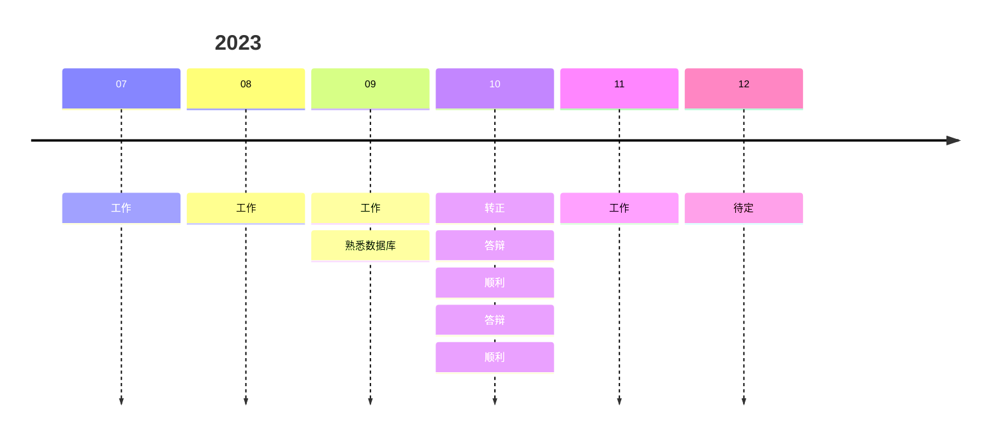
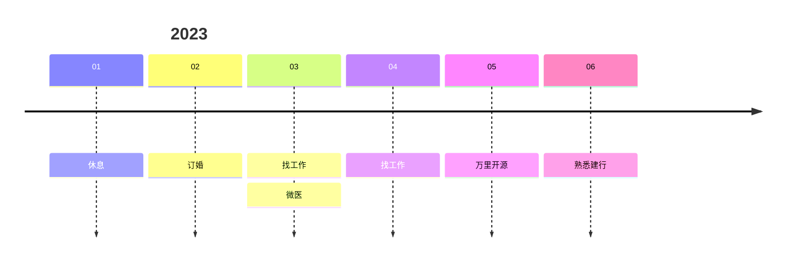


- [meimaid](https://cdn.jsdelivr.net/npm/mermaid@10.6.0/)



<!---->
生活记录


## 2023

下半年

```mermaid
timeline
        title 2023
        07 : 工作
        08 : 工作
        09 : 工作
                : 熟悉数据库
        10 : 转正 : 答辩 : 顺利 : 答辩 : 顺利
        11 : 工作
        12 : 待定

```

上半年

```mermaid
timeline
        title 2023
        01 : 休息
        02 : 订婚
        03 : 找工作
                : 微医
        04 : 找工作
        05 : 万里开源
        06 : 熟悉建行

```





dhdhhd

  
25%

ddd

  

ddd

  

