

### Mermaid能绘制哪些图？

1. 流程图（Flowchart）：展示过程、决策和操作流程。使用graph关键字

2. 序列图（Sequence Diagram）：展示对象之间的交互顺序。使用sequenceDiagram关键字

3. 甘特图（Gantt Chart）：展示项目计划和进度。使用gantt关键字

4. 类图（Class Diagram）：展示类的结构和关系。使用classDiagram关键字

5. 饼图（Pie Chart）：展示数据占比。使用pie关键字

6. 捷径图（Shortcut）：简单展示快捷方式。

7. 状态图（State Diagram）：展示对象状态的转换。使用stateDiagram关键字

8. 用户旅程图（Journey）：展示用户如何与应用程序交互。使用journey关键字

9. 除此之外，Mermaid 还支持其他类型的图表，例如任务图（Task）和网路拓扑图（Network Topology），以及自定义的图表类型。Mermaid 的语法简单而灵活，可以让用户轻松地创建各种类型的图表。


### 参考资料

- [Mermaid](https://mermaid.nodejs.cn/syntax/flowchart.html)







`classDef k8s fill:#326ce5,stroke:#fff,stroke-width:4px,color:#fff;`

- 设置节点背景颜色：fill:#326ce5

- 设置边框颜色：stroke:#fff

- 设置节点边框宽度：stroke-width:4px

- 设置节点文字颜色：color:#fff

`class ingress,service,pod1,pod2 k8s;`

- 表示将 k8s 样式应用到节点：ingress,service,pod1,pod2




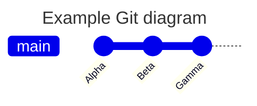


## 举例说明
```sql
graph LR;
  client([客户端])-. Ingress-管理的 <br> 负载均衡器 .->ingress[Ingress];
  ingress-->|路由规则|service[Service];
  subgraph cluster
  ingress;
  service-->pod1[Pod];
  service-->pod2[Pod];
  end
  classDef plain fill:#ddd,stroke:#fff,stroke-width:4px,color:#000;
  classDef k8s fill:#3371e3,stroke:#fff,stroke-width:4px,color:#fff;
  classDef cluster fill:#fff,stroke:#bbb,stroke-width:2px,color:#326ce5;
  class ingress,service,pod1,pod2 k8s;
  class client plain;
  class cluster cluster;
```

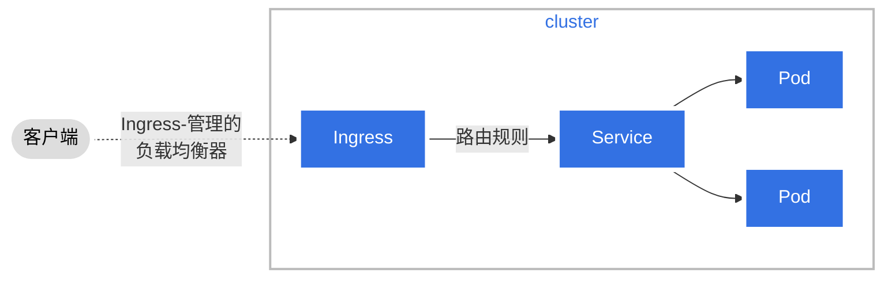


## 举例说明
```sql
flowchart LR
A([fa:fa-user 新的<br>贡献者]) --- id1[(kubernetes/website<br>GitHub)]
subgraph tasks[使用 GitHub 提交变更]
direction TB
    0[ ] -.-
    1[1. 编辑此页] --> 2[2. 使用 GitHub markdown<br>编辑器进行修改]
    2 --> 3[3. 填写 Propose file change]

end
subgraph tasks2[ ]
direction TB
4[4. 选择 Propose file change] --> 5[5. 选择 Create pull request] --> 6[6. 填写 Open a pull request]
6 --> 7[7. 选择 Create pull request]
end

id1 --> tasks --> tasks2

classDef grey fill:#dddddd,stroke:#ffffff,stroke-width:px,color:#000000, font-size:15px;
classDef white fill:#ffffff,stroke:#000,stroke-width:px,color:#000,font-weight:bold
classDef k8s fill:#326ce5,stroke:#fff,stroke-width:1px,color:#fff;
classDef spacewhite fill:#ffffff,stroke:#fff,stroke-width:0px,color:#000
class A,1,2,3,4,5,6,7 grey
class 0 spacewhite
class tasks,tasks2 white
class id1 k8s
```

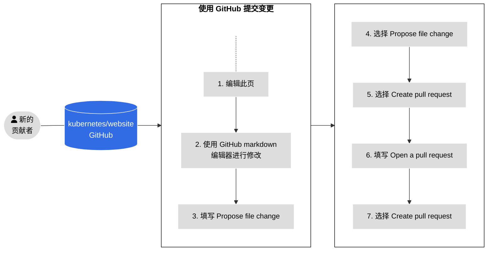


## 举例说明
```sql
flowchart LR
1[派生 kubernetes/website<br>仓库] --> 2[创建本地克隆副本<br>并指定 upstream 仓库]
subgraph changes[你的变更]
direction TB
S[ ] -.-
3[创建一个分支<br>例如: my_new_branch] --> 3a[使用文本编辑器<br>进行修改] --> 4["使用 Hugo 在本地<br>预览你的变更<br>(localhost:1313)<br>或构建容器镜像"]
end
subgraph changes2[提交 / 推送]
direction TB
T[ ] -.-
5[提交你的变更] --> 6[将提交推送到<br>origin/my_new_branch]
end

2 --> changes --> changes2

classDef grey fill:#dddddd,stroke:#ffffff,stroke-width:px,color:#000000, font-size:15px;
classDef white fill:#ffffff,stroke:#000,stroke-width:px,color:#000,font-weight:bold
classDef k8s fill:#326ce5,stroke:#fff,stroke-width:1px,color:#fff;
classDef spacewhite fill:#ffffff,stroke:#fff,stroke-width:0px,color:#000
class 1,2,3,3a,4,5,6 grey
class S,T spacewhite
class changes,changes2 white
```

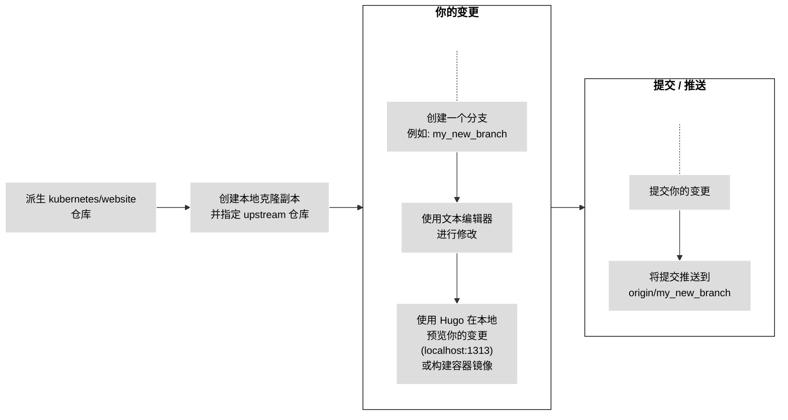


   ```none
   origin	git@github.com:<github_username>/website.git (fetch)
   origin	git@github.com:<github_username>/website.git (push)
   upstream	https://github.com/kubernetes/website.git (fetch)
   upstream	https://github.com/kubernetes/website.git (push)
   ```


### 方向：用于开头，声明流程图的方向

```bash

graph或graph TB或graph TD：从上往下

graph BT：从下往上

graph LR：从左往右

graph RL：从右往左

```


### 结点

```bash

无名字的结点：直接写内容，此时结点边框为方形；节点内容不支持空格

有名字的结点：节点名后书写内容，内容左右有特定符号，结点边框由符号决定；节点内容可以有空格

下面的实例中，没有为graph指定方向，因此默认是从上往下的。但是由于各个结点之前没有箭头，所以他们都处于同一排。id1-id6是节点名，可随意定义。

```
```bash
graph
    默认方形
    id1[方形]
    id2(圆边矩形)
    id3([体育场形])
    id4[[子程序形]]
    id5[(圆柱形)]
    id6((圆形))

```


```bash
graph
	id1{菱形}
	id2{{六角形}}
	id3[/平行四边形/]
	id4[\反向平行四边形\]
	id5[/梯形\]
	id6[\反向梯形/]

```

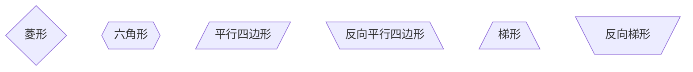


### 连线样式

1. 实线箭头：分为无文本箭头和有文本箭头，有文本箭头有2种书写格式


```bash
graph LR
a-->b--文本1-->c-->|文本2|d

```

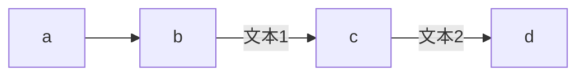

2. 粗实线箭头：分为无文本箭头和有文本箭头

```bash
graph LR
a==>b==文本==>c

```

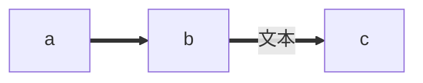

3. 虚线箭头：分为无文本箭头和有文本箭头

```bash
graph LR
a-.->b-.文本.->c

```

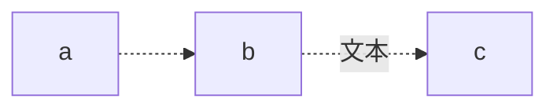

4. 无箭头线：即以上三种连线去掉箭头后的形式


```bash
graph LR
a---b
b--文本1!---c
c---|文本2|d
d===e
e==文本3===f
f-.-g
g-.文本.-h

```

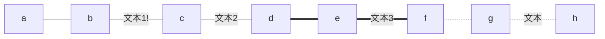


### 举例说明

1. 案例一

```bash
flowchart LR
        id1(数列不等式)
        id2(求通项)
        id3(无法求通项)
        id5(直接求和)
        id6(比较通项)
        id7(数学归纳)
        id8(放缩裂项)
        id9(放缩等比)
        id10(放缩差比)
        id12(不可求和)
        id13(结束)
        id1-->id2;
        id1-->id3;
        id2 -->id5;
        id2-->id12;
        id12-->id6;
        id12-->id7;
        id12-->id8;
        id12-->id9;
        id12-->id10;
        id5 --> id13;

```


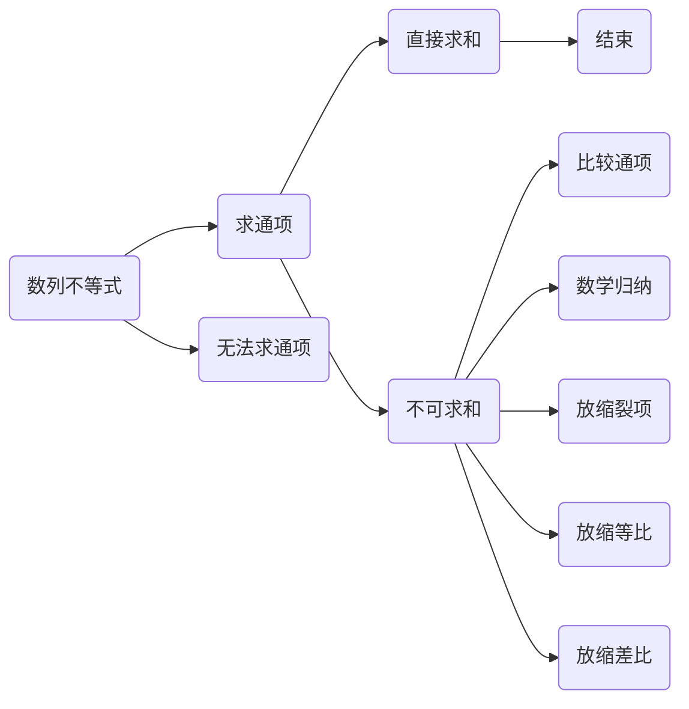

### 案例二

```bash
graph TD;
    A-->B;
    A-->C;
    B-->D;
    C-->D;

```


### 案例三

```bash
flowchart LR
    A[Hard edge] -->|Link text| B(Round edge)
    B --> C{Decision}
    C -->|One| D[Result one]
    C -->|Two| E[Result two]

```


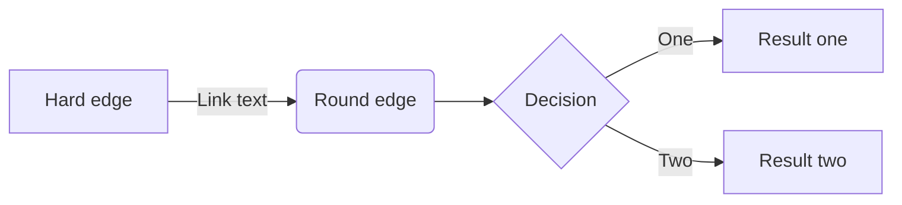


## 饼状图
> 从pie关键字开始图表
> 使用title关键字及其在字符串中的值，为饼图赋予标题。
> 数据部分在" "内写上分区名。
> 分区名后使用:作为分隔符
> 分隔符后写上数值，最多支持2位小数——数据会以百分比的形式展示


### 举例说明

1. 案例一
```bash
pie
    title 为什么总是宅在家里？
    "喜欢宅" : 15
    "天气太热或太冷" : 20
    "穷" : 500

```

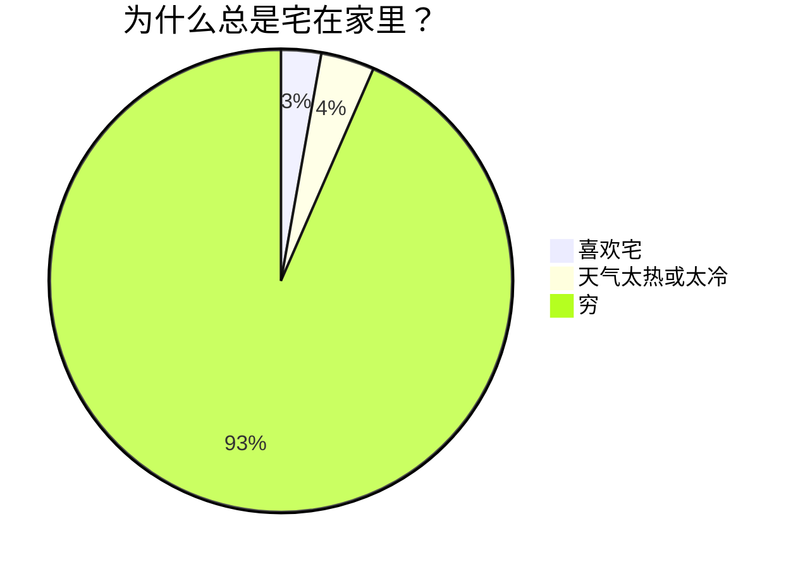

2. 案例二
```bash
pie
  title 水果
  "Apples" : 45.0
  "Oranges" : 25.0
  "Bananas" : 15.0
  "Grapes" : 10.0
  "Pears" : 5.0

```
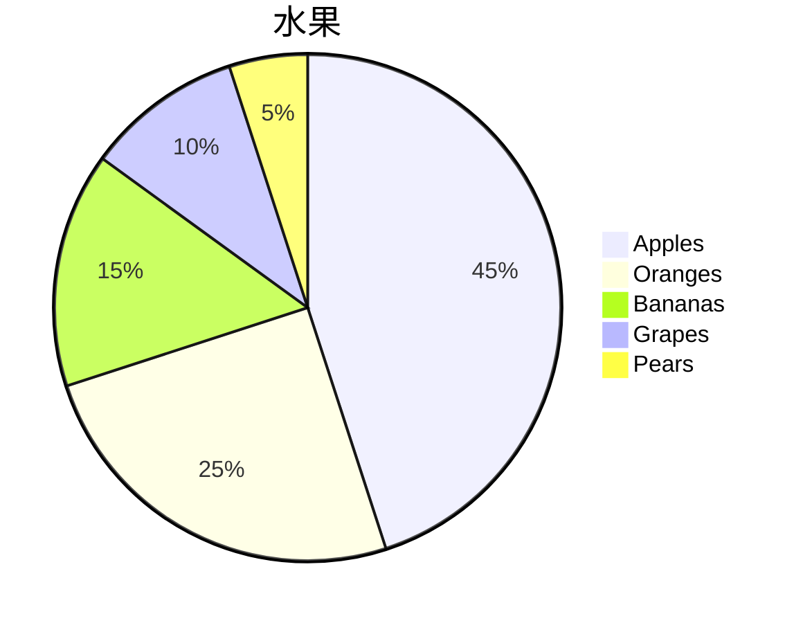

3. 案例三
```bash
pie
   title Example
   "First slice": 30
   "Second slice": 20
   "Third slice": 50

```
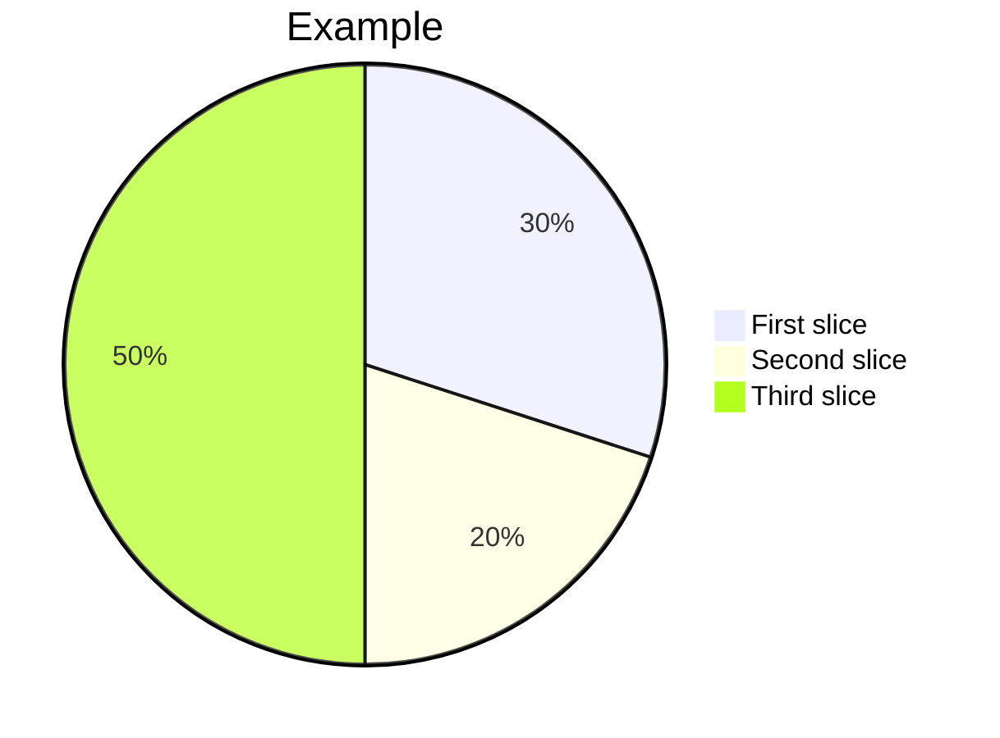


