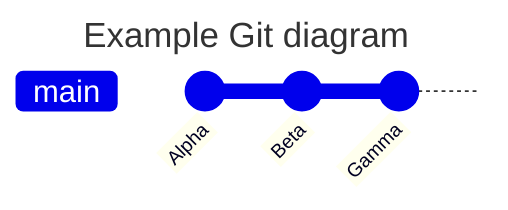
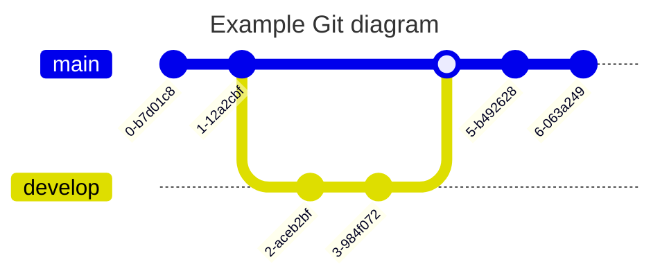
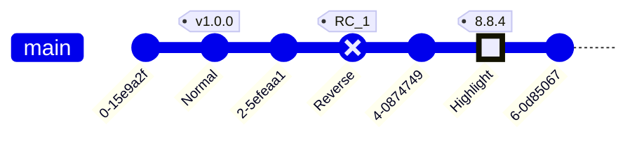
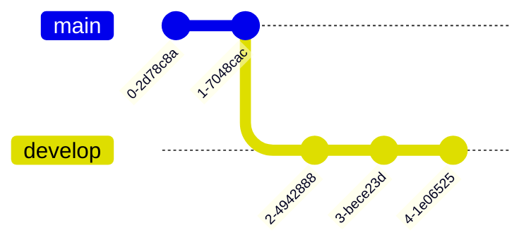
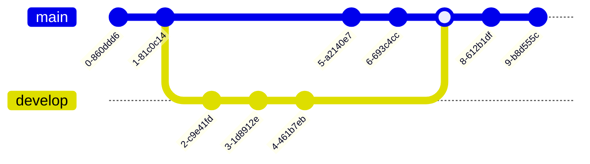
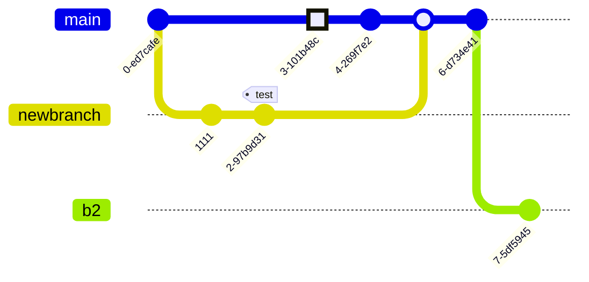









```mermaid
---
title: Example Git diagram
---
    gitGraph
       commit id: "Alpha"
       commit id: "Beta"
       commit id: "Gamma"

```

```mermaid
---
title: Example Git diagram
---
gitGraph
   commit
   commit
   branch develop
   checkout develop
   commit
   commit
   checkout main
   merge develop
   commit
   commit

```

```mermaid
    gitGraph
       commit
       commit id: "Normal" tag: "v1.0.0"
       commit
       commit id: "Reverse" type: REVERSE tag: "RC_1"
       commit
       commit id: "Highlight" type: HIGHLIGHT tag: "8.8.4"
       commit

```

```mermaid
    gitGraph
       commit
       commit
       branch develop
       commit
       commit
       commit

```

```mermaid
    gitGraph
       commit
       commit
       branch develop
       commit
       commit
       commit
       checkout main
       commit
       commit
       merge develop
       commit
       commit

```

```mermaid
gitGraph:
    commit "Ashish"
    branch newbranch
    checkout newbranch
    commit id:"1111"
    commit tag:"test"
    checkout main
    commit type: HIGHLIGHT
    commit
    merge newbranch
    commit
    branch b2
    commit

```
