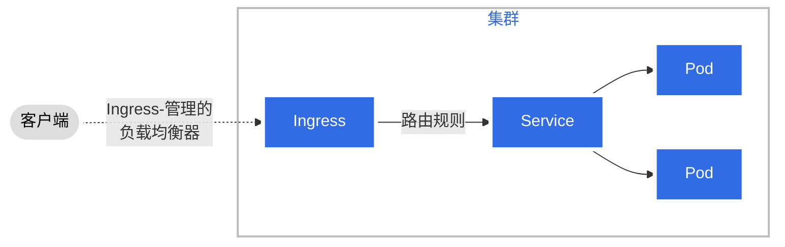


1. npm
2. Go
3. Hugo (Extended version)



## windows上安装

1. git clone https://github.com/kubernetes/website.git

2. cd website

3. git submodule update \-\-init \-\-recursive \-\-depth 1

4. npm ci

5. hugo.exe server \-\-buildFuture \-\-environment development \-\-port 1314

```sql
PS C:\hugo> cd .\website\
PS C:\hugo\website> git submodule update --init --recursive --depth 1
Submodule 'api-ref-generator' (https://github.com/kubernetes-sigs/reference-docs) registered for path 'api-ref-generator'
Submodule 'themes/docsy' (https://github.com/google/docsy.git) registered for path 'themes/docsy'
Cloning into 'C:/hugo/website/api-ref-generator'...
Cloning into 'C:/hugo/website/themes/docsy'...
remote: Total 0 (delta 0), reused 0 (delta 0), pack-reused 0
remote: Enumerating objects: 226, done.
remote: Counting objects: 100% (226/226), done.
remote: Compressing objects: 100% (111/111), done.
Receiving objects: 100% (126/126), 172.56 KiB | 1.50 MiB/s, done.Receiving objects:  98% (124/126)

Resolving deltas: 100% (87/87), completed with 69 local objects.
From https://github.com/kubernetes-sigs/reference-docs
 * branch            55bce686224caba37f93e1e1eb53c0c9fc104ed4 -> FETCH_HEAD
Submodule path 'api-ref-generator': checked out '55bce686224caba37f93e1e1eb53c0c9fc104ed4'
Submodule 'themes/docsy' (https://github.com/google/docsy.git) registered for path 'api-ref-generator/themes/docsy'
Cloning into 'C:/hugo/website/api-ref-generator/themes/docsy'...
remote: Total 0 (delta 0), reused 0 (delta 0), pack-reused 0
remote: Enumerating objects: 316, done.
remote: Counting objects: 100% (315/315), done.
remote: Compressing objects: 100% (173/173), done.
remote: Total 188 (delta 73), reused 72 (delta 6), pack-reused 0
Receiving objects: 100% (188/188), 1.71 MiB | 5.26 MiB/s, done.
Resolving deltas: 100% (73/73), completed with 65 local objects.
From https://github.com/google/docsy
 * branch            6b30513dc837c5937de351f2fb2e4fedb04365c4 -> FETCH_HEAD
Submodule path 'api-ref-generator/themes/docsy': checked out '6b30513dc837c5937de351f2fb2e4fedb04365c4'
Submodule 'assets/vendor/Font-Awesome' (https://github.com/FortAwesome/Font-Awesome.git) registered for path 'api-ref-generator/themes/docsy/assets/vendor/Font-Awesome'
Submodule 'assets/vendor/bootstrap' (https://github.com/twbs/bootstrap.git) registered for path 'api-ref-generator/themes/docsy/assets/vendor/bootstrap'
Cloning into 'C:/hugo/website/api-ref-generator/themes/docsy/assets/vendor/Font-Awesome'...
Cloning into 'C:/hugo/website/api-ref-generator/themes/docsy/assets/vendor/bootstrap'...
remote: Total 0 (delta 0), reused 0 (delta 0), pack-reused 0
remote: Enumerating objects: 8907, done.
remote: Counting objects: 100% (8904/8904), done.
remote: Compressing objects: 100% (2867/2867), done.
remote: Total 4846 (delta 3007), reused 2276 (delta 1978), pack-reused 0
Receiving objects: 100% (4846/4846), 5.77 MiB | 6.45 MiB/s, done.
Resolving deltas: 100% (3007/3007), completed with 861 local objects.
From https://github.com/FortAwesome/Font-Awesome
 * branch            fcec2d1b01ff069ac10500ac42e4478d20d21f4c -> FETCH_HEAD
Submodule path 'api-ref-generator/themes/docsy/assets/vendor/Font-Awesome': checked out 'fcec2d1b01ff069ac10500ac42e4478d20d21f4c'
remote: Total 0 (delta 0), reused 0 (delta 0), pack-reused 0
remote: Enumerating objects: 704, done.
remote: Counting objects: 100% (704/704), done.
remote: Compressing objects: 100% (522/522), done.
remote: Total 539 (delta 108), reused 196 (delta 13), pack-reused 0
Receiving objects: 100% (539/539), 2.58 MiB | 2.31 MiB/s, done.
Resolving deltas: 100% (108/108), completed with 66 local objects.
From https://github.com/twbs/bootstrap
 * branch            a716fb03f965dc0846df479e14388b1b4b93d7ce -> FETCH_HEAD
Submodule path 'api-ref-generator/themes/docsy/assets/vendor/bootstrap': checked out 'a716fb03f965dc0846df479e14388b1b4b93d7ce'
remote: Total 0 (delta 0), reused 0 (delta 0), pack-reused 0
remote: Enumerating objects: 376, done.
remote: Counting objects: 100% (375/375), done.
remote: Compressing objects: 100% (211/211), done.
remote: Total 225 (delta 89), reused 77 (delta 4), pack-reused 0

Receiving objects: 100% (225/225), 1.73 MiB | 3.08 MiB/s, done.
Resolving deltas: 100% (89/89), completed with 80 local objects.
From https://github.com/google/docsy
 * branch            1c77bb24483946f11c13f882f836a940b55ad019 -> FETCH_HEAD
Submodule path 'themes/docsy': checked out '1c77bb24483946f11c13f882f836a940b55ad019'
Submodule 'assets/vendor/Font-Awesome' (https://github.com/FortAwesome/Font-Awesome.git) registered for path 'themes/docsy/assets/vendor/Font-Awesome'
Submodule 'assets/vendor/bootstrap' (https://github.com/twbs/bootstrap.git) registered for path 'themes/docsy/assets/vendor/bootstrap'
Cloning into 'C:/hugo/website/themes/docsy/assets/vendor/Font-Awesome'...
Cloning into 'C:/hugo/website/themes/docsy/assets/vendor/bootstrap'...
remote: Total 0 (delta 0), reused 0 (delta 0), pack-reused 0
remote: Enumerating objects: 8908, done.
remote: Counting objects: 100% (8905/8905), done.
remote: Compressing objects: 100% (2742/2742), done.
remote: Total 4847 (delta 3024), reused 2430 (delta 2104), pack-reused 0Receiving objects: 100% (4847/4847), 5.54 MiB | Receiving objects: 100% (4847/4847), 5.70 MiB | 5.28 MiB/s, done.

Resolving deltas: 100% (3024/3024), completed with 834 local objects.
From https://github.com/FortAwesome/Font-Awesome
 * branch            7d3d774145ac38663f6d1effc6def0334b68ab7e -> FETCH_HEAD
Submodule path 'themes/docsy/assets/vendor/Font-Awesome': checked out '7d3d774145ac38663f6d1effc6def0334b68ab7e'
remote: Total 0 (delta 0), reused 0 (delta 0), pack-reused 0
remote: Enumerating objects: 774, done.
remote: Counting objects: 100% (774/774), done.
remote: Compressing objects: 100% (515/515), done.
remote: Total 542 (delta 145), reused 196 (delta 19), pack-reused 0
Receiving objects: 100% (542/542), 2.59 MiB | 4.74 MiB/s, done.
Resolving deltas: 100% (145/145), completed with 110 local objects.
From https://github.com/twbs/bootstrap
 * branch            043a03c95a2ad6738f85b65e53b9dbdfb03b8d10 -> FETCH_HEAD
Submodule path 'themes/docsy/assets/vendor/bootstrap': checked out '043a03c95a2ad6738f85b65e53b9dbdfb03b8d10'
PS C:\hugo\website>


PS C:\hugo\website> npm ci
npm WARN old lockfile
npm WARN old lockfile The package-lock.json file was created with an old version of npm,
npm WARN old lockfile so supplemental metadata must be fetched from the registry.
npm WARN old lockfile
npm WARN old lockfile This is a one-time fix-up, please be patient...
npm WARN old lockfile
npm WARN deprecated core-js-pure@3.6.5: core-js-pure@<3.23.3 is no longer maintained and not recommended for usage due to the number of issues. Because of the V8 engine whims, feature detection in old core-js versions could cause a slowdown up to 100x even if nothing is polyfilled. Some versions have web compatibility issues. Please, upgrade your dependencies to the actual version of core-js-pure.

added 119 packages in 7s
PS C:\hugo\website> hugo.exe server --buildFuture --environment development
WARN  DEPRECATED: Kind "taxonomyterm" used in disableKinds is deprecated, use "taxonomy" instead.
WARN  config: languages.pt-br.languagenamelatinscript: custom params on the language top level is deprecated and will be removed in a future release. Put the value below [languages.pt-br.params]. See https://gohugo.io/content-management/multilingual/#changes-in-hugo-01120
WARN  config: languages.pl.description: custom params on the language top level is deprecated and will be removed in a future release. Put the value below [languages.pl.params]. See https://gohugo.io/content-management/multilingual/#changes-in-hugo-01120
WARN  config: languages.pl.languagenamelatinscript: custom params on the language top level is deprecated and will be removed in a future release. Put the value below [languages.pl.params]. See https://gohugo.io/content-management/multilingual/#changes-in-hugo-01120
WARN  config: languages.ko.description: custom params on the language top level is deprecated and will be removed in a future release. Put the value below [languages.ko.params]. See https://gohugo.io/content-management/multilingual/#changes-in-hugo-01120
WARN  config: languages.ko.languagenamelatinscript: custom params on the language top level is deprecated and will be removed in a future release. Put the value below [languages.ko.params]. See https://gohugo.io/content-management/multilingual/#changes-in-hugo-01120
WARN  config: languages.no.description: custom params on the language top level is deprecated and will be removed in a future release. Put the value below [languages.no.params]. See https://gohugo.io/content-management/multilingual/#changes-in-hugo-01120
WARN  config: languages.no.languagenamelatinscript: custom params on the language top level is deprecated and will be removed in a future release. Put the value below [languages.no.params]. See https://gohugo.io/content-management/multilingual/#changes-in-hugo-01120
WARN  config: languages.vi.description: custom params on the language top level is deprecated and will be removed in a future release. Put the value below [languages.vi.params]. See https://gohugo.io/content-management/multilingual/#changes-in-hugo-01120
WARN  config: languages.vi.languagenamelatinscript: custom params on the language top level is deprecated and will be removed in a future release. Put the value below [languages.vi.params]. See https://gohugo.io/content-management/multilingual/#changes-in-hugo-01120
WARN  config: languages.uk.languagenamelatinscript: custom params on the language top level is deprecated and will be removed in a future release. Put the value below [languages.uk.params]. See https://gohugo.io/content-management/multilingual/#changes-in-hugo-01120
WARN  config: languages.uk.description: custom params on the language top level is deprecated and will be removed in a future release. Put the value below [languages.uk.params]. See https://gohugo.io/content-management/multilingual/#changes-in-hugo-01120
WARN  config: languages.zh-cn.languagenamelatinscript: custom params on the language top level is deprecated and will be removed in a future release. Put the value below [languages.zh-cn.params]. See https://gohugo.io/content-management/multilingual/#changes-in-hugo-01120
WARN  config: languages.hi.languagenamelatinscript: custom params on the language top level is deprecated and will be removed in a future release. Put the value below [languages.hi.params]. See https://gohugo.io/content-management/multilingual/#changes-in-hugo-01120
WARN  config: languages.es.languagenamelatinscript: custom params on the language top level is deprecated and will be removed in a future release. Put the value below [languages.es.params]. See https://gohugo.io/content-management/multilingual/#changes-in-hugo-01120
WARN  config: languages.id.description: custom params on the language top level is deprecated and will be removed in a future release. Put the value below [languages.id.params]. See https://gohugo.io/content-management/multilingual/#changes-in-hugo-01120
WARN  config: languages.id.languagenamelatinscript: custom params on the language top level is deprecated and will be removed in a future release. Put the value below [languages.id.params]. See https://gohugo.io/content-management/multilingual/#changes-in-hugo-01120
WARN  config: languages.fr.description: custom params on the language top level is deprecated and will be removed in a future release. Put the value below [languages.fr.params]. See https://gohugo.io/content-management/multilingual/#changes-in-hugo-01120
WARN  config: languages.fr.languagenamelatinscript: custom params on the language top level is deprecated and will be removed in a future release. Put the value below [languages.fr.params]. See https://gohugo.io/content-management/multilingual/#changes-in-hugo-01120
WARN  config: languages.de.description: custom params on the language top level is deprecated and will be removed in a future release. Put the value below [languages.de.params]. See https://gohugo.io/content-management/multilingual/#changes-in-hugo-01120
WARN  config: languages.de.languagenamelatinscript: custom params on the language top level is deprecated and will be removed in a future release. Put the value below [languages.de.params]. See https://gohugo.io/content-management/multilingual/#changes-in-hugo-01120
WARN  config: languages.it.languagenamelatinscript: custom params on the language top level is deprecated and will be removed in a future release. Put the value below [languages.it.params]. See https://gohugo.io/content-management/multilingual/#changes-in-hugo-01120
WARN  config: languages.ru.languagenamelatinscript: custom params on the language top level is deprecated and will be removed in a future release. Put the value below [languages.ru.params]. See https://gohugo.io/content-management/multilingual/#changes-in-hugo-01120
WARN  config: languages.ja.languagenamelatinscript: custom params on the language top level is deprecated and will be removed in a future release. Put the value below [languages.ja.params]. See https://gohugo.io/content-management/multilingual/#changes-in-hugo-01120
WARN  config: languages.ja.description: custom params on the language top level is deprecated and will be removed in a future release. Put the value below [languages.ja.params]. See https://gohugo.io/content-management/multilingual/#changes-in-hugo-01120
Watching for changes in C:\hugo\website\{archetypes,assets,content,data,layouts,package.json,postcss.config.js,static,themes}
Watching for config changes in C:\hugo\website\hugo.toml, C:\hugo\website\themes\docsy\config.toml, C:\hugo\website\go.mod
Start building sites …
hugo v0.118.2-da7983ac4b94d97d776d7c2405040de97e95c03d+extended windows/amd64 BuildDate=2023-08-31T11:23:51Z VendorInfo=gohugoio
```


## 本地化

## 替换 all.js
1. 下载all.js到project/static/js/all.js

2. 在project/layouts/blog/baseof.html文件中 将 https://use.fontawesome.com/releases/v5.0.6/js/all.js 替换为 /js/all.js

## 替换 font-face.css
1. 下载font-face.css到project/static/css/font-face.css

2. project\themes\docsy\assets\scss\rtl\_main.scss 和 project\api-ref-generator\themes\docsy\assets\scss\rtl\_main.scss 将 https://cdn.jsdelivr.net/gh/rastikerdar/vazir-font@v27.0.1/dist/font-face.css 替换为 /css/font-face.css

```sql
wget https://use.fontawesome.com/releases/v5.0.6/js/all.js

wget https://cdn.jsdelivr.net/gh/rastikerdar/vazir-font@v27.0.1/dist/font-face.css

```





