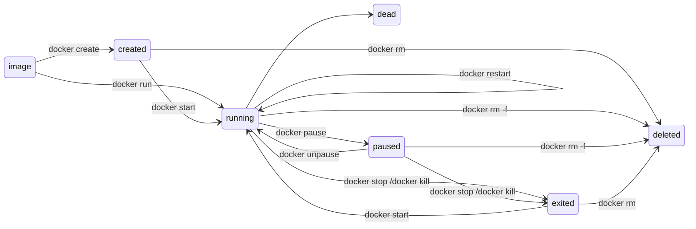



### （1）容器状态：

1. created（已创建）

2. restarting（重启中）

3. running（运行中）

4. removing（迁移中）

5. paused（暂停）

6. exited（停止）

7. dead（死亡）


### （2）状态转移图：










##


```sql
# "查看Docker运行中的容器"
docker ps

```


