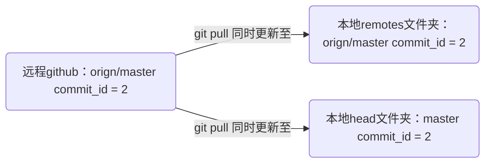
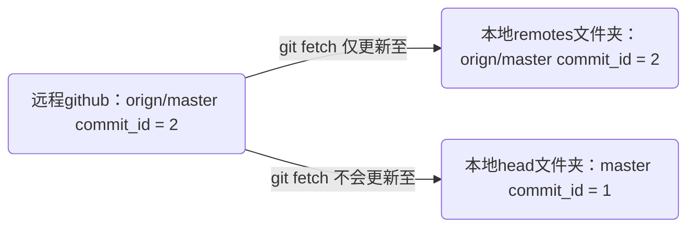


This is a placeholder page. Replace it with your own content.


问题背景
某项目，假如有100个分支。
我本地，有5个分支，a,b,c,d,e。
我经常需要取别人的最新，所以我现在只能：

先切换到a，然后取最新；
再切换到b，取最新
再切换到c，取最新
以此类推，直至全部取到最新。
那么，怎样一次取到所有分支的最新？

一、忽悠
随便一搜，都说什么 git pull --all 或者 git fetch --all 这样的。
也不知道这么说的人究竟试过没有，我真的是试验了无数次。
假如我自己当前在a分支，我执行git pull 是取到了当前a分支的最新，我执行git pull --all也是取到了当前a分支的最新。
fetch也一样。
我感觉不到它们有任何区别。
如果真的有什么区别，麻烦路过的大牛指点一下。

尽管我似乎在哪里看到过，意思大概就是说 诸如 git pull --all 这命令的all指的究竟是什么，是可以设置，或者说指定的。但我并没有找到明确的办法。

就是上面说的这个情况，网上随便一搜都这么说，拿去一试，然并卵。
包括google和英文世界里搜的也基本是这个情况。

二、 抬杠
某天，我实在是受够了，想着无论如何，今天一定把这个问题给解决了。
找了许久，找到一个办法。
虽说不是那么优雅吧，但总好过原来的方式。
命令（能算是命令吗?）：
for i in git branch | sed ‘s/^.//’; do git checkout $i ; git pull; done

含义很明显，不解释了。
它就可以取到本地分支的每个分支的最新内容。

