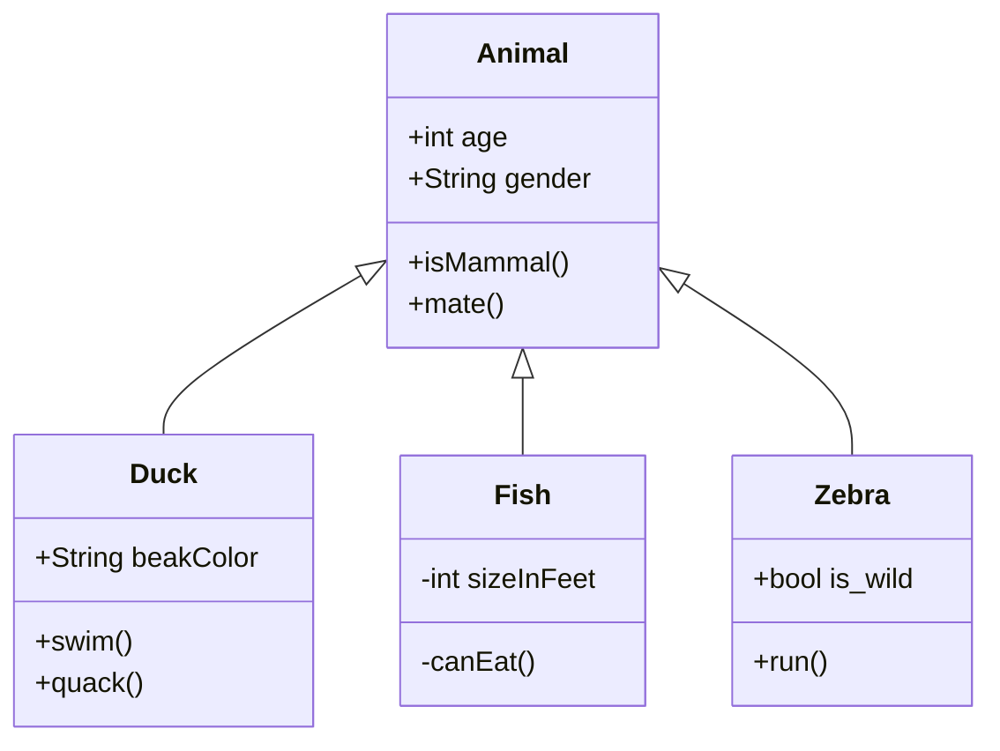
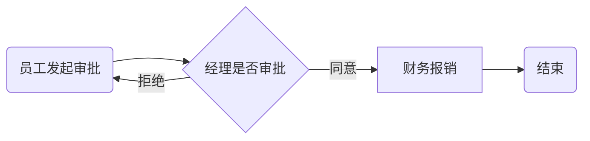
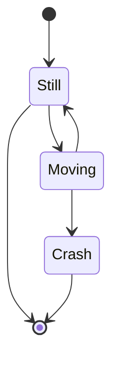
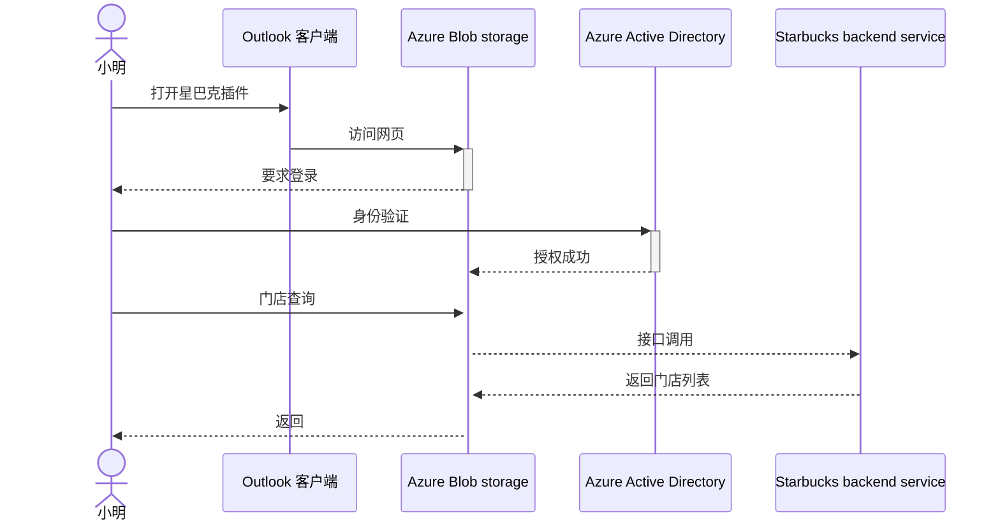
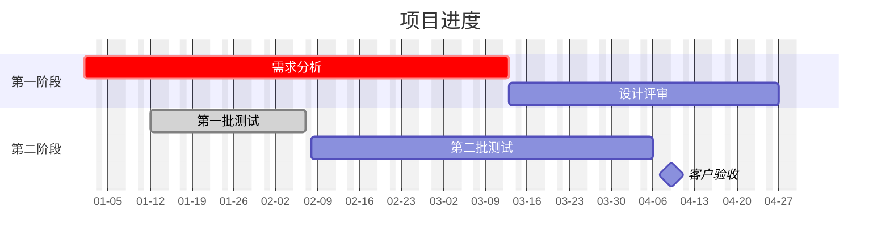
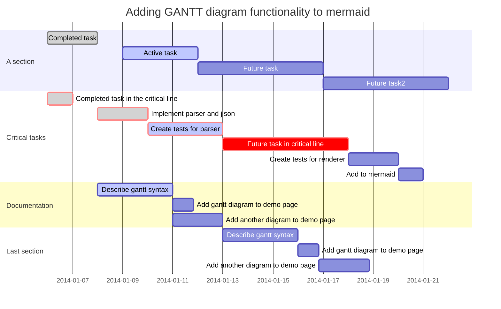
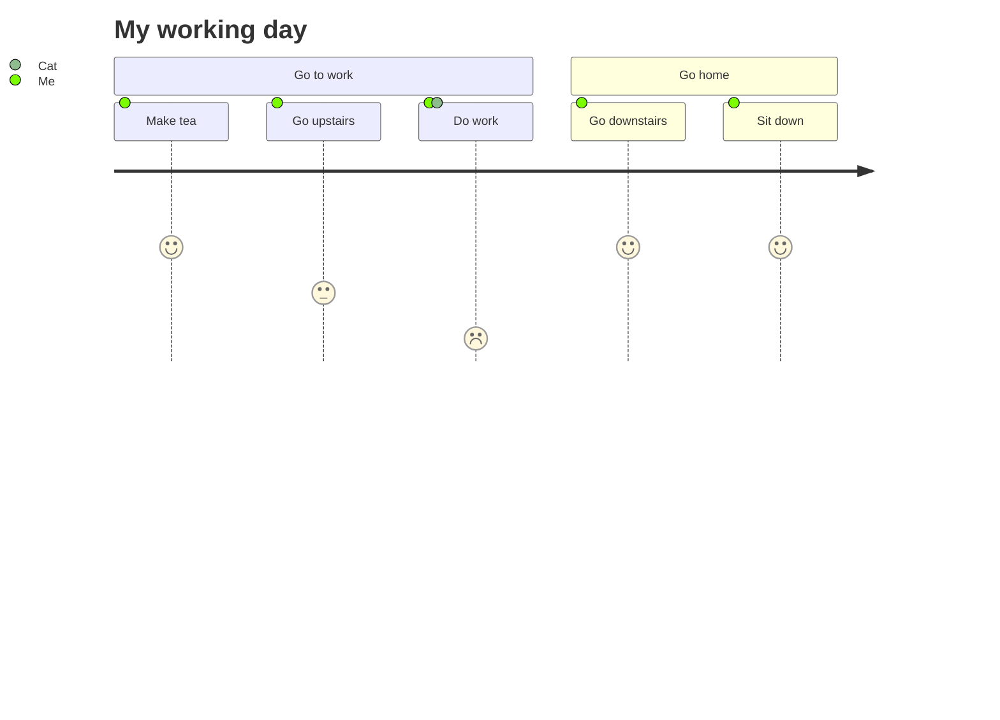
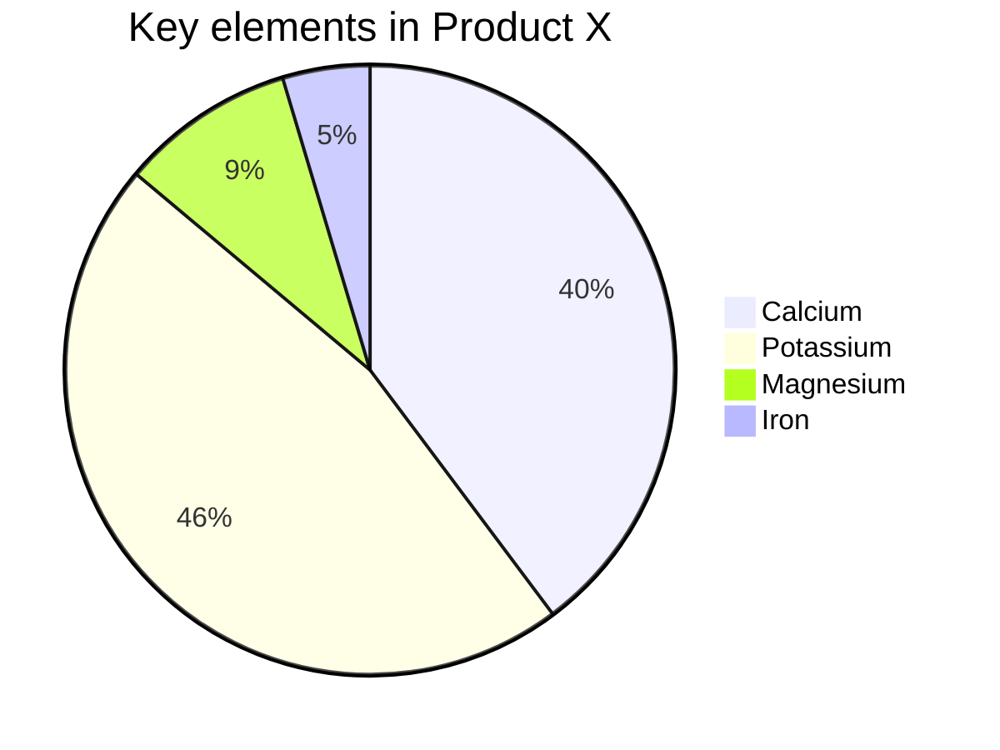

## mermaid

- https://soft.xiaoshujiang.com/docs/grammar/feature/mermaid/
- https://mermaid.js.org/

#### 类图

#### 流程图

在 graph 的后方添加流程图的显示方向

- TB -从上到下
- BT - 从下到上
- RL - 从右到左
- LR - 从左到右
- TD - 跟 TB 一样，从上到下

#### 状态图

#### 序列图

#### 甘特图

#### 用户行程图

#### 饼图

