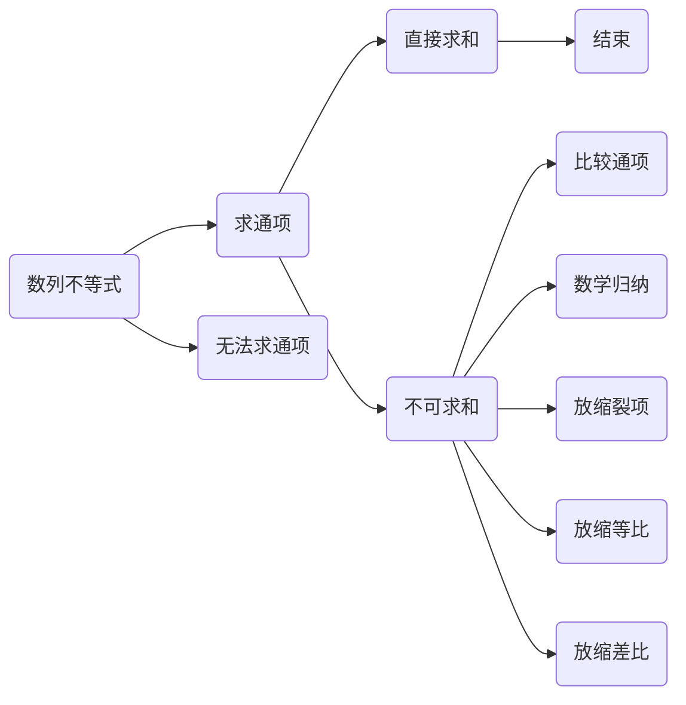



### 证明：$a_n < a_{n+1}$
构造函数
### 证明：$a_{n+1} - a_n < \cfrac{\sqrt{2}+1}{8}$
构造函数

### 证明：$2a_{n+1} - a_n \le \cfrac{a_{n+1}a_n}{2}$
构造函数

### 证明：$A< a_n < B$
归纳

### 证明：$g(n) < a_n < f(n)$
归纳

### 证明：$\sin{a_n} < \cfrac{1}{\sqrt{n}}$

### 放缩单调

### 通项放缩

$$ \sum_{i=1}^{i=n} < f(n) $$

【】设数列$\\{ a_n \\}$和$\\{ b_n \\}$的前$n$项和分别为$S_n$和$T_n$，若$a_n < b_n$，证明：$S_n < T_n$

【解析】根据题意，$a_n < b_n$，可得：

$a_1 < b_1$

$a_2 < b_2$

$a_3 < b_3$

$\cdots\cdots$

$a_{n-1} < b_{n-1}$

$a_n < b_n$

将上述不等式相加，可得：$a_1+a_2+a_3+\cdots+a_{n-1}+a_n < b_1+b_2+b_3+\cdots+b_{n-1}+b_n$

可得：$S_n < T_n$





（1）和式不等式

$$\sum_{i=1}^{i=n}{a_i} \le C$$
$$\sum_{i=1}^{i=n}{a_i} \ge C$$

$$\sum_{i=1}^{i=n}{a_i} \le f(n)$$
$$\sum_{i=1}^{i=n}{a_i} \ge f(n)$$
（2）积式不等式

（3）通项不等式

（4）递推不等式（主要是单调）

（5）比较大小、最值、极限

（6）$\cfrac{x}{1+x} < \ln(1+x) < x $



